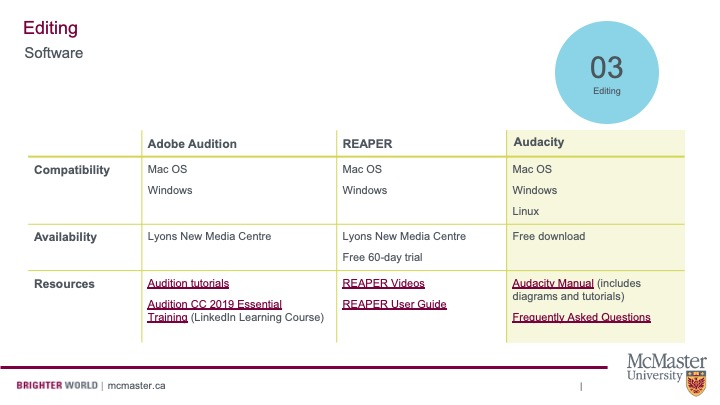

## Before Editing Checklist

Before you begin to edit your podcast, there are a few things you should consider:
- Transfer your audio files to your computer and place them in a folder.
- Sort through your audio files, renaming the files accordingly.
- Create backup copies of your unedited audio files in a separate folder.
- Use headphones instead of solely relying on your computer’s speakers.
- Keep your script nearby – This will act as a guide as you edit.
- And of course, downloading and installing an audio editing program. But which one?

## Choosing an Audio Editor

There are plenty of audio editing tools that you can use. Consult the graph below to choose a software package that will work for you. 

Links to resources in the chart:

[Adobe Tutorials on Audition](https://www.adobe.com/products/audition.html?gclid=Cj0KCQjwuMuRBhCJARIsAHXdnqPBybDTMGOPecaAC1TXJXdzKcYU4E8ZXMy3YLoB51uhgxJGI9M22kYaAhXIEALw_wcB&sdid=KKQPG&mv=search&ef_id=Cj0KCQjwuMuRBhCJARIsAHXdnqPBybDTMGOPecaAC1TXJXdzKcYU4E8ZXMy3YLoB51uhgxJGI9M22kYaAhXIEALw_wcB:G:s&s_kwcid=AL!3085!3!379170499152!b!!g!!%2Baudition!6463395489!76921253229)

[LinkedIn Learning Course on Audition](https://www.linkedin.com/learning/topics/audition?src=go-pa&veh=sem_src.go-pa_c.LLS-C_NAMER_CA_T1_EN-US_SEM_SEM_GoogleAds_NA_All_NA_NA_Core_NA_Course-DSA_Nonbrand_DSA_pkw._pmt._pcrid.447373008606_pdv.c_plc._trgid.dsa-977546883567_net.g_learning&trk=sem_src.go-pa_c.LLS-C_NAMER_CA_T1_EN-US_SEM_SEM_GoogleAds_NA_All_NA_NA_Core_NA_Course-DSA_Nonbrand_DSA_pkw._pmt._pcrid.447373008606_pdv.c_plc._trgid.dsa-977546883567_net.g_learning&mcid=6841846450872316141&cname=&camid=10509116058&asid=103415742185&targetid=dsa-977546883567&crid=447373008606&placement=&dev=c&ends=1&gclid=Cj0KCQjwuMuRBhCJARIsAHXdnqOukwLcyerTBzAKbFtYd84uqWtXgWkOiyfTAqilScMwLEMGPVQ3vXwaAn82EALw_wcB&gclsrc=aw.ds)

[Reaper Videos](https://www.reaper.fm/videos.php)

[Reaper User Guide](https://www.reaper.fm/userguide.php)

[Audacity Manual](https://manual.audacityteam.org/)

[Audacity Frequently Asked Questions](https://manual.audacityteam.org/man/faq.html)

## Learn to Edit Audio on Audacity

Audacity is a free audio editing software. Because of its accessibility, it's our preferred platform. Watch the video below to learn how to use the program. Elaine will show you how to cut out unwanted noises, reduce background noise, add background music, and more. 

<iframe width="100%" height="416" src="https://www.youtube.com/embed/ci3QnCj9nHc?si=IMmxj5qxXZRxM2_R&amp;start=64" title="YouTube video player" frameborder="0" allow="accelerometer; autoplay; clipboard-write; encrypted-media; gyroscope; picture-in-picture" allowfullscreen></iframe>

View the original [here](https://www.youtube.com/watch?v=ci3QnCj9nHc&t=64s).

You can also watch three video tutorials by Veronica, which overview:

- i) Audio Editing Basics (Downloading Audacity, Importing Audio, Cutting Audio, Reducing Noise, and Normalizing Audio Levels) 
- ii) Inserting Clips (Finding Clips, Converting to MP3, Editing Clips, Inserting Clips to Your Recording) 
- iii) Inserting Music and Exporting Your File (Finding Music, Editing Music, Fading Music In and Out, Inserting Music to Your Recording)

## Video One: Audio Editing Basics

<iframe height="416" width="100%" allowfullscreen frameborder=0 src="https://echo360.ca/media/18938986-cf5c-49bd-bdb6-95864477c5ce/public"></iframe>

View the original [here](https://echo360.ca/media/18938986-cf5c-49bd-bdb6-95864477c5ce/public).

Links: 
- [Download Audacity](https://www.audacityteam.org/download/)
- [Access Files to Follow Along with this Tutorial including a Text Guide](https://mcmasteru365-my.sharepoint.com/:f:/g/personal/littvs_mcmaster_ca/EhvuAQn-hcJJokJ1RXac080BM9ibG0uunWyf7QAvRApoqg?e=fDyJar)

## Video Two: Inserting Clips

<iframe height="416" width="100%" allowfullscreen frameborder=0 src="https://echo360.ca/media/9ce364a5-6def-4595-9641-353846b52459/public"></iframe>

View the original [here](https://echo360.ca/media/9ce364a5-6def-4595-9641-353846b52459/public)

Links:
- [MP3 Converter](https://onlinevideoconverter.com/)
- [Access Files to Follow Along with this Tutorial including a Text Guide](https://mcmasteru365-my.sharepoint.com/:f:/g/personal/littvs_mcmaster_ca/EhvuAQn-hcJJokJ1RXac080BM9ibG0uunWyf7QAvRApoqg?e=fDyJar)

## Video Three: Inserting Music and Exporting Your File

<iframe height="416" width="100%" allowfullscreen frameborder=0 src="https://echo360.ca/media/9fc9417b-8eda-4a27-9bac-3e0d7bc3c79e/public"></iframe>

View the original [here](https://echo360.ca/media/9fc9417b-8eda-4a27-9bac-3e0d7bc3c79e/public).

Links: 
- [Copyright Compliant Music](https://pixabay.com/music/)
- [Access Files to Follow Along with this Tutorial including a Text Guide](https://mcmasteru365-my.sharepoint.com/:f:/g/personal/littvs_mcmaster_ca/EhvuAQn-hcJJokJ1RXac080BM9ibG0uunWyf7QAvRApoqg?e=fDyJar)

## Copyright Concerns

Many podcasts use music at some point in the episode. If you do not have the budget to hire a composer, browse repositories like [Pixabay](https://pixabay.com/music/search/theme/music%20for%20videos/) and the YouTube Audio Library for audio that you can legally use in your show. Note that the YouTube Audio Library cannot be linked because it is accessed through the "Creator Studio"--which simply means that you need a (free) YouTube account to access the files.

