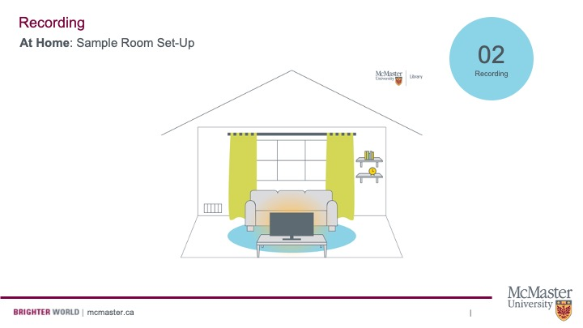
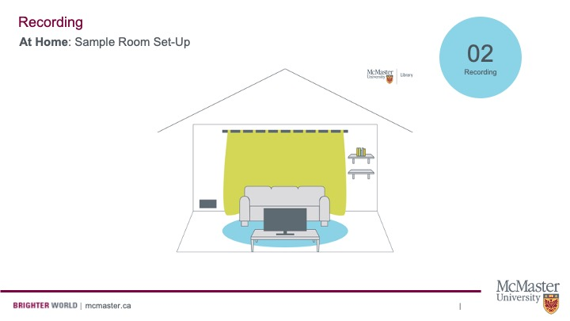

## Prepare your Recording Environment

Recording professional-sounding audio at home is possible! Here are some tips from Elaine Westenhoefer from McMaster University's Lyons New Media Centre:

First, optimize your at-home recording set-up. Pictured here is a drawing of a typical living room. There is a window with the curtains open, a couch in front of a television, a rug on the floor, an open air vent on the wall beside the window, and some wall shelves with items on them on the other side of the window. Simple adjustments to a room like this can positively impact audio recording quality.

Pictured here is the same living room, but with a few adjustments made.

The curtains are closed.
- Fabric is an excellent sound-absorber. As you close the curtains, you are creating more fabric surface area, which will reduce echo in your audio recording. Some people even like to record in their closets because of the natural insulation provided by their clothes.

The television is turned off.
- Electronics, such as televisions are sources of background noise. Even when on a low volume or muted, these devices omit electrical noise, which are audio waves that can be picked up by microphones. It is best to turn off or unplug these devices.

The air vent is closed.
- Blowing air is a source of background noise. This makes for an even worse recording when the circulation system turns on and off throughout the recording – This can be difficult to edit out. Either close any vents near you, or better yet, turn the system off while you record.

The clock is gone from the shelf.
- Quietly sit in the recording space and listen for any additional sources of noise, such as ticking clocks. Remove these from your recording environment.

## Top Tips for Before you Record

Now that your environment is prepped, it's time to record. 

- If you're wearing ear buds with the mic on the cord, hold it up with your hand so that it doesn't rest on your clothing (or else it will record scratchy noises every time you move).

- If you're recording on your phone, make sure it has enough storage space. For long recordings, consider breaking up your script into smaller segments.

- Set your phone to airplane mode or do not disturb to prevent any distractions or notification noises.

- Locate where the microphone is on your phone. Make sure it is not covered and that it is pointed at you when you record.

- You can use a piece of fabric or even a sock to cover the bottom of your phone, to act as a wind shield.

- Make sure the mic is about 8 inches from your face when recording. This will avoid breath from hitting the mic, and is close enough to capture your voice well.

## Record Great Audio on your Phone

Watch Elaine's video to learn how to record great audio with your Android phone.

<iframe width="100%" height="416" src="https://www.youtube.com/embed/05JJdxltrsI" title="YouTube video player" frameborder="0" allow="accelerometer; autoplay; clipboard-write; encrypted-media; gyroscope; picture-in-picture" allowfullscreen></iframe>

View the original [here](https://www.youtube.com/watch?v=05JJdxltrsI).

Watch Elaine's video to learn how to record great audio with your iPhone. 

<iframe width="100%" height="416" src="https://www.youtube.com/embed/npc14BB_p6o" title="YouTube video player" frameborder="0" allow="accelerometer; autoplay; clipboard-write; encrypted-media; gyroscope; picture-in-picture" allowfullscreen></iframe>

View the original [here]( https://www.youtube.com/watch?v=npc14BB_p6o).

##  Record Great Audio at Lyons New Media Centre

Lyons New Media Centre has special audio recording booths that the McMaster community can book and use. Get a sense of the facility with this video:

<iframe width="100%" height="416" src="https://www.youtube.com/embed/JMD7JJNMtes" title="YouTube video player" frameborder="0" allow="accelerometer; autoplay; clipboard-write; encrypted-media; gyroscope; picture-in-picture" allowfullscreen></iframe>

View the original [here](https://www.youtube.com/watch?v=JMD7JJNMtes).

The booths include Blue Yeti microphones. Learn to use a Blue Yeti with the video below:

<iframe width="100%" height="416" src="https://www.youtube.com/embed/RftkB5g84eI" title="YouTube video player" frameborder="0" allow="accelerometer; autoplay; clipboard-write; encrypted-media; gyroscope; picture-in-picture" allowfullscreen></iframe>

View the original [here](https://www.youtube.com/watch?v=RftkB5g84eI).

Book either of the audio recording booths at [this link](https://library.mcmaster.ca/spaces/lyons#tab-spacesrooms).
