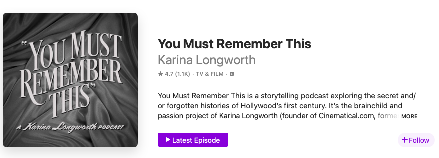

## Make a Great First Impression

Most of the time, new listeners don’t encounter podcasts as audio. They encounter them visually and textually through three things:

1. Show Title 
2. Description/Logline 
- Brief 1-2 sentence description of the show’s content, format, and tone
3. Tile Image 
- The image that will represent the show on podcatchers and distributors. Also called "graphic collateral," this is like the movie poster equivalent of a podcast. It includes an image, symbol, and/or font, all of which have the capacity to convey meaning. 

Collectively, these three things must hook listeners by communicating a tremendous amount of information--topic, tone, the show’s identity--in a very small space. The big takeaway: **Don't underestimate the power of good branding.** Be as intentional and thoughtful as possible when you design your show's tile image, logline, and title. 

## Case Study: You Must Remember This

Let's look at an example of a podcast that branded itself well: Karina Longworth's Old Hollywood podcast, "You Must Rememebr This." Here's how "You Must Remember This" appears to someone scrolling through Apple Podcasts. 

Let's break down why Longworth's branding works.

**Show Title**: "You Must Remember This" is a brilliant title. It grabs the reader with its direct address and, through its imperative voice, orders us to tune in and "remember" alongside Longworth. We "must"! The phrase that forms the title also cleverly mixes old and new, breathing life into historical material. We still use the phrase "you must remember this” in casual conversation, making the title fresh and relevant to a modern audience, but it’s also a line from what is perhaps the most famous old Hollywood movie ever, Casablanca. The line occurs when Sam sings “You must remember this, a kiss is just a kiss, a sigh is just a sigh…”

**Logline**: "A podcast exploring the secret and/or forgotten histories of Hollywood's first century." This logline works because it describes its topic (Old Hollywood history) and pitches its potential audience with an intriguing and unique angle (we're not just learning about cinema history, we're learning about "the secret and/or forgotten histories of Hollywood's first century."). Longworth manages to straightforwardly lay out the show's topic and entice listeners with the promise of scandals and secret histories. This balance gives the logline its power. 

**Tile Image**: The typography evokes Old Hollywood films, with the cloth draping subtly suggesting a theatre curtain. It conveys its subject without the title explicitly needing to say "This is a show about cinema history." The simplicity of the image is also a point in its favour. Because these images are typically displayed in quite a small size on phones and other media players, a simple design is usually best. If anything could be improved, the colour contrast could be heighteened to ensure that everyone can clearly see the difference between the text and the background. To check the colour contrast of your own image, use this [contrast checker](https://webaim.org/resources/contrastchecker/) tool. 

## Creating a Tile: Hire Someone or Do It Yourself?
Graphic design is a specialized skill. When creating a tile for your podcast, you need top think about whether you want to hire someone or do it yourself. Here are the pros and cons of each approach.

### Option 1: Hire Somone
Find a freelancer on Fiver or a similar freelancer directory ($)
- Pro: Budget friendly. Con: Minimal communication with designer.
For the McMaster Community, consider using the university's Media Production Services ($$)
- Pro: Great to support our colleagues and they are professionals. Con: If you need revisions, the hourly rate will add up quickly. 
Hire a graphic design firm ($$$)
- Pro: Professionals know what they are doing, can help with marketing plans and other design items you may need (web banners, different sizes and formats for social media platforms, et cetera), and they will ensure you get what you want. Con: The most expensive option.

### Option 2: Do It Yourself
Use Adobe Illustrator or Adobe Photoshop (you can access these paywalled programs at Lyons New Media in Mills Library)  
Use a free software or web-based design application like Canva, GIMP, or Inkscape.   
If you need help, book a consultation or attend a workshop at Lyons New Media.   
Media Help Consultations & Workshops (Lyons).

## Copyright Concerns
Make sure that you use a font and image with a commercial use license. If your show becomes profitable, this will keep you safe from lawsuits. 
Look at websites like Pexels, Unsplash, and Wikimedia Commons. 
