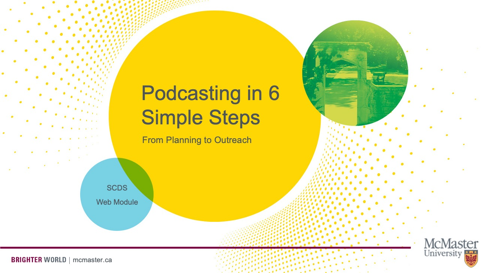

# Welcome to Podcasting 101

Podcasts can take academic research out of the ivory tower and into the public. Learn the basics of podcasting in this web module by Podcaster and SCDS Coordinator Veronica Litt and Digital Media Specialist Elaine Westenhoefer. We'll take you through a podcast’s life cycle, from planning to recording to distribution.

