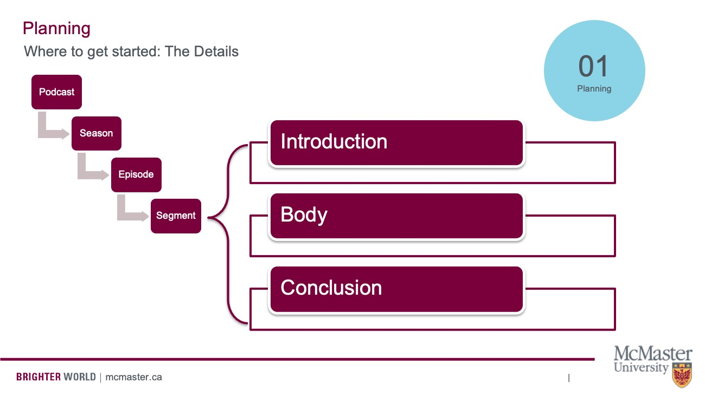

## Coming up with a Topic

To begin the planning process, you'll want to chose a topic. The first step to figuring out a topic is having a good ol' brainstorming session. 

Here are some prompts to get you started.
- What do you find yourself thinking about a lot?
- Do you have any interesting hobbies?
- Do you have a unique perspective on something that you would like to share?
- Is there something that makes you feel a strong emotion (happy, confusion, anger)?
- Do you want to rant about something? What makes you tic? 

After you brainstorm a general topic, you will want to refine it a bit and find the angle you'd like to approach it from. A good show won't just have a topic. It'll also have a unique perspective on that topic.

## Who is your Ideal Listener?

Once you know your topic and angle, then you'll want to get an idea of your ideal listener. This could also be thought of as your target audience or a user persona.

Is your ideal listener an academic? A member of the general public audience? What’s the age of your listener, the gender, the education?

Remember, audiences actively select particular media to satisfy their own needs, so what should you cover in your podcast that would attract your ideal listener? What would align with their values, attitudes, or beliefs? People make media choices by determining how gratified they will be from consuming that particular media. You can also think about intentionally troubling your ideal listener's beliefs, especially if your show is interested in making a particular social argument (i.e./ explaining the importance of affordable housing to peope who may not have a natural interest in that topic). 

## Planning the Entire Show

Once you have an idea of the show you want to make and your ideal listener, keep both of these in mind as you move ahead and consider nuts and bolts planning elements of your show, like format, frequency, tone, and length. 

- Format: Will there be weekly episodes that relate to one overarching topic, seasons that focus on sub-topics? Will the show continue into perpetuity, are you going to create a limited run of 6-8 episodes and end it there?
- Frequency: You'll want to consider how often new episodes come out. Weekly, bi-weekly, monthly? 
- Tone: Is your show serious, irreverent, funny, thoughtful?
- Length: How long is each episode? 20 minutes? 40 minutes? 1 hour? 

## Planning Individual Episodes

Planning a podcast means understanding the way individual segments relate to the entire show at large. Consider this chart, which breaks down the different levels of a podcast. 

Each podcast is made of seasons (if applicable), which are in turn composed of linked episodes. These episodes are, in turn, made up of segments. 

You can think of a podcast episode’s segments the way you think about an essay. 

Shows typically begin with an introduction, followed by the body of the show, then end with a conclusion. 

You can get creative with all these elements, but the most diversity is usually found in the body, so let’s zoom in on that. 

The body of a podcast may be a discussion between co-hosts, a formal interview, a debate, a scripted monologue, or something else entirely.

Within each of these formats, there are even more sub-categories. If you’re doing a guided discussion, what topics will you cover and in what order? If an interview, you have to plan your questions ahead of time and make sure they flow. If a debate, which side goes first? Will you include rebuttals? And so on and so forth.

The big point here is that you can't just sit down and record. You need to draft your episode ahead of time and understand its different segments and how they relate to the episode and the show at large.

In other words, you need an outline and oftentimes, especially in repeated elements like an introductory greeting and a sign off, you need a script. 

## Scripted Segments

A great podcast script won't sound scripted.
Keep things conversational in tone, paying attention to word choice. Read your script out loud and think "Is this the way I talk?" Our brains understand language differently if we’re reading versus listening. Make sure to use clear and understandable language. 

Tips:
- It might be helpful to mark up your script to indicate where you emphasize words, leave pauses, mark inflections.
- Be descriptive with your words, as this will help listeners visualize what you're talking about. 
- Remember, podcasting is an audio medium. Be selective about topics that rely on visual media. 
