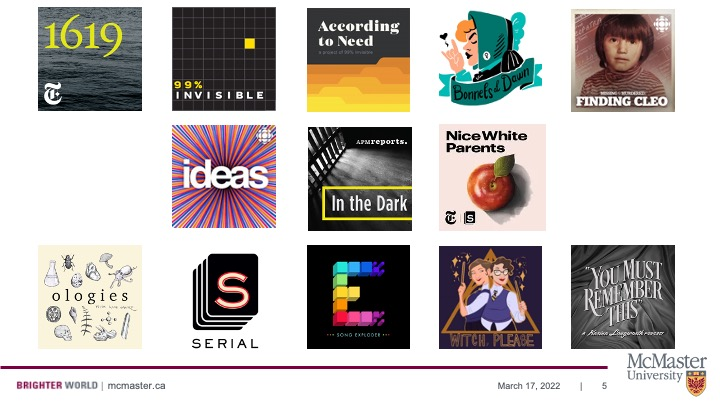

# What is a Podcast? 

"A digital audio file of speech, music, broadcast material, etc., made available on the internet for downloading to a computer or portable media player; a series of such files, new instalments of which can be received by subscribers automatically." - Oxford English Dictionary

The OED covers the basic definition of a podcast, but the best way to learn about podcasts is to experience one. We've collected some of our favourites below: 

- [1619](https://www.nytimes.com/2020/01/23/podcasts/1619-podcast.html)
- [99% Invisible](https://99percentinvisible.org/) 
- [According to Need](https://99percentinvisible.org/need/) 
- [Bonnets at Dawn](https://soundcloud.com/bonnetsatdawn) 
- [Ideas](https://www.cbc.ca/listen/live-radio/1-23-ideas?cmp=DM_SEM_Listen_Titles)
- [In the Dark Season 2](https://features.apmreports.org/in-the-dark/season-two/) 
- [Missing & Murdered: Finding Cleo](https://www.cbc.ca/listen/cbc-podcasts/148-missing-murdered-finding-cleo)
- [Nice White Parents](https://www.nytimes.com/2020/07/23/podcasts/nice-white-parents-serial.html)
- [Ologies](alieward.com/ologies) 
- [Serial Season 3](https://serialpodcast.org/) 
- [Song Exploder](https://songexploder.net/) 
- [Witch, Please](http://ohwitchplease.ca/) 
- [You Must Remember This](http://www.youmustrememberthispodcast.com/) 

As you'll hear, podcasts can encompass a wide variety of material, but across subjects, podcasts use clear language and a conversational tone. They are designed to be understood by a broad group of listeners.

## Why Should I Make a Podcast?
Here are five reasons to make a podcast: 

1. They're cheap
- In the world of media production, podcasts are very cost-effective. All you need is a microphone, editing software, and an internet connection. Between free software packages and the microphone in your cell phone, it's very possible to make a podcast without spending money. 

2. They're easy to create
- Podcasts can seem daunting, but they're much simpler than you may think. The rest of this module will show you how to make your own show in six simple steps.

3. They build communities
- Podcasts can take farflung people with a shared interest and unite them into a global online community. 

4. They mobilize knowledge
- As universities prioritize knowledge mobilization and community engagement, academics are looking for ways to share their research with the public. Podcasts are a fantastic way to accomplish this crucial outreach work. 

5. They're fun and fulfilling
- Self-explanatory. Creating a podcast is engaging and enjoyable. You'll connect with kindred spirits, learn new skills, and more. 

